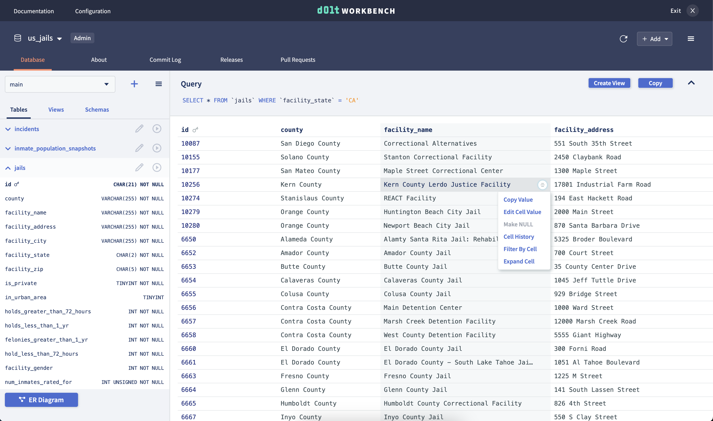

# dolt-workbench

A modern SQL workbench for your MySQL-compatible database. Use [Dolt](https://doltdb.com) 
to unlock powerful version control features.



## Getting started

The easiest way to get started is with Docker. Assuming you have Docker
[installed](https://www.docker.com/get-started/) and running, you can simply pull and run
the image.

```
% docker pull dolthub/dolt-workbench:combined
% docker run -p 9002:9002 -p 3000:3000 dolthub/dolt-workbench:combined
```

Navigate to http://localhost:3000 to enter your database information.

You can find more in-depth instructions on
[DockerHub](https://hub.docker.com/repository/docker/taylorbantle1/dolt-workbench).

## Getting started from source

First, clone this repository.

### Run the GraphQL server

Start the GraphQL server. If successful, you'll see the GraphQL playground when you navigate to `localhost:9002/graphql`.

```
% cd graphql-server
graphql-server % yarn && yarn compile
graphql-server % yarn dev
```

If you want the server to start up with a configured database connection, add a
`.development.env` file with a `DATABASE_URL` field, like so:

```bash
DATABASE_URL="mysql://[username]:[password]@[host]/[database]"
```

Otherwise you will be able to provide connection information from the UI.

### Run the web server

In another shell, start the web server. This will automatically point at the running
GraphQL server (localhost:9002).

```
% cd packages/web
web % yarn && yarn compile
web % yarn dev
```

Open your browser to [localhost:3002](http://localhost:3002).
