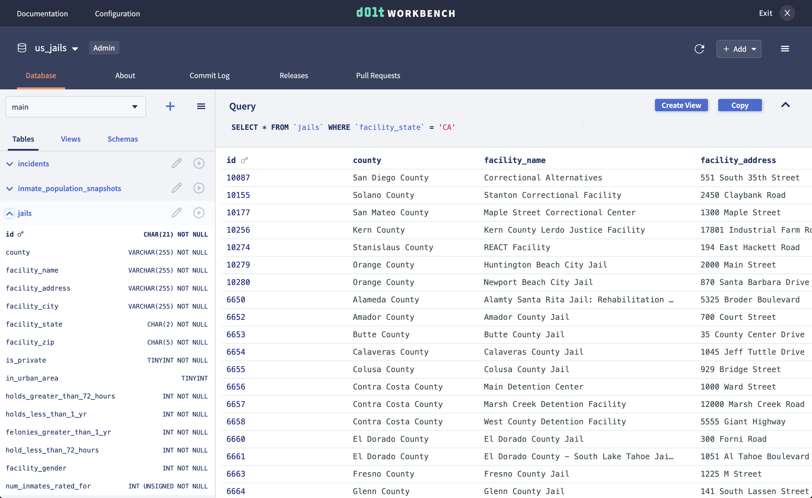
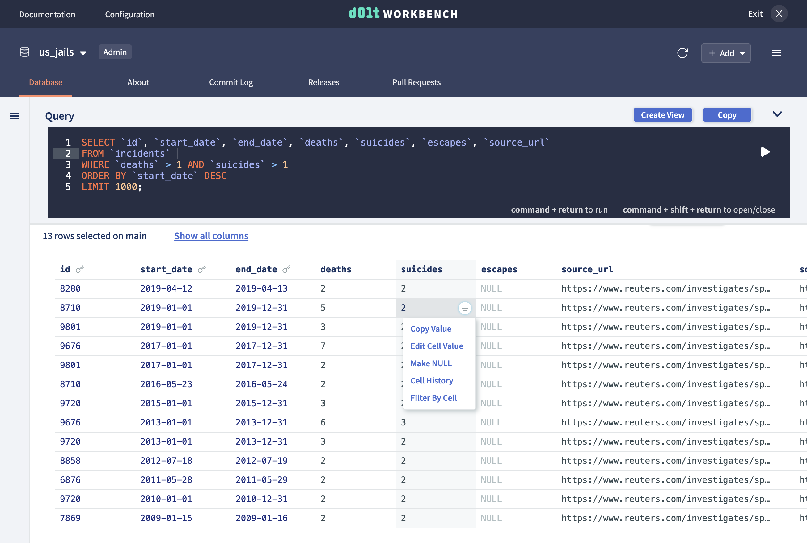
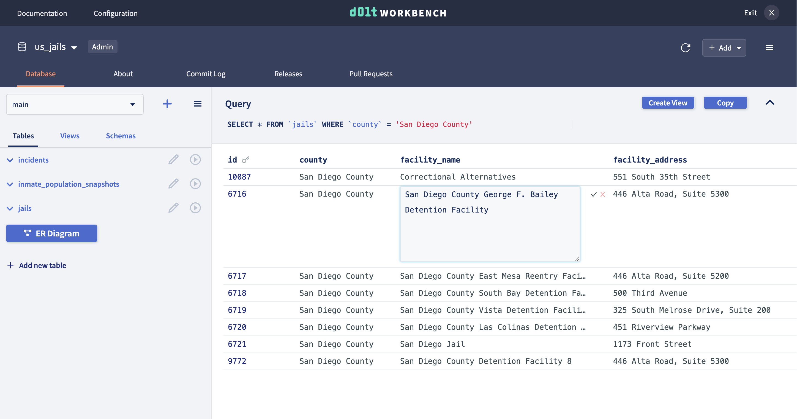
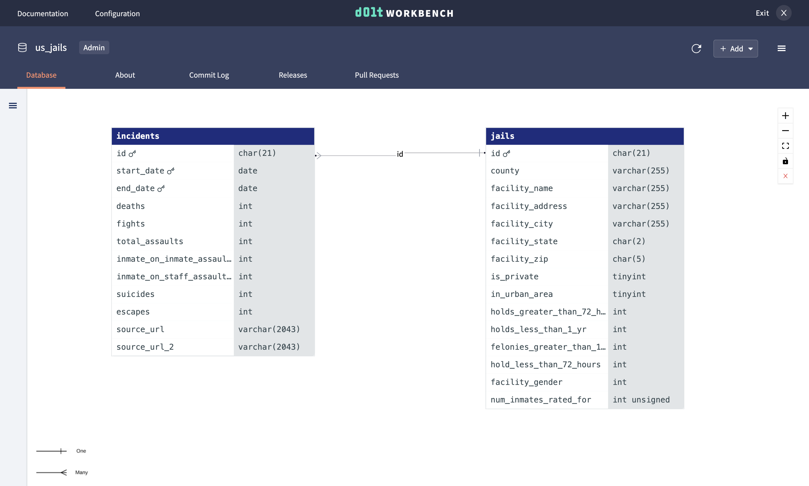
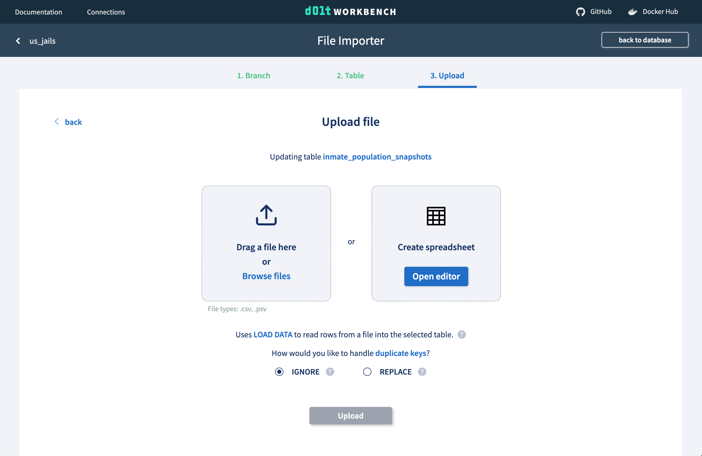
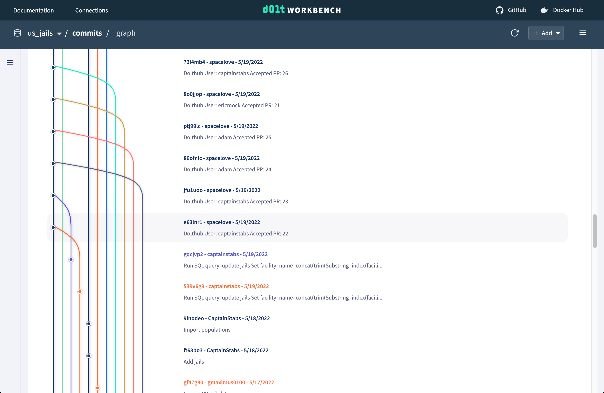
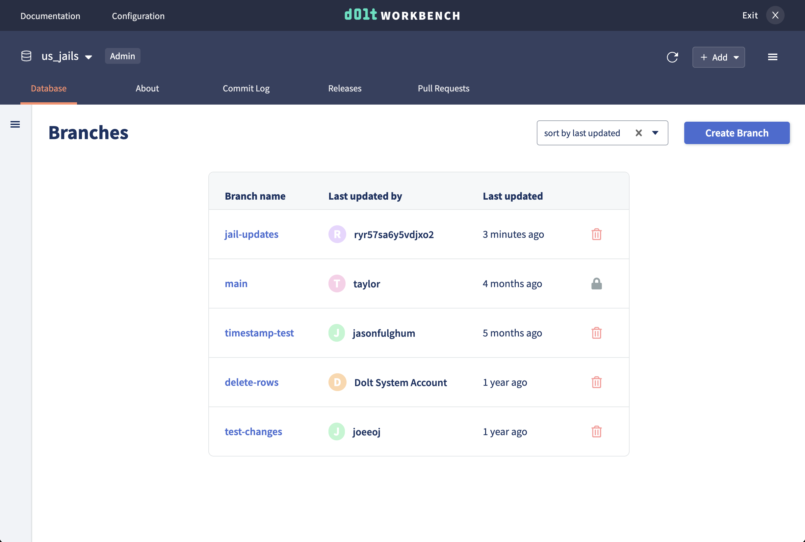
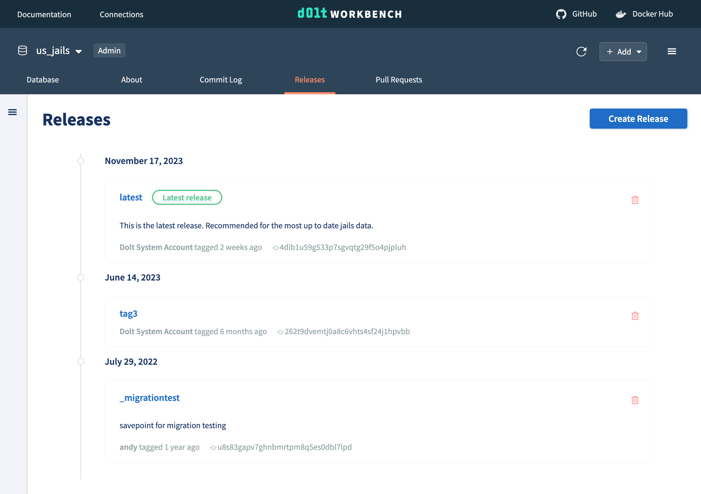
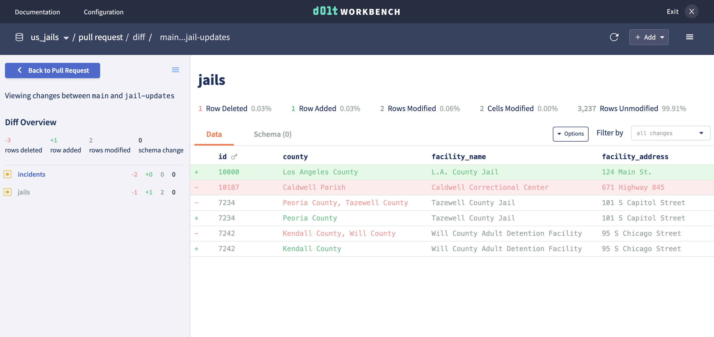

# dolt-workbench

A modern SQL workbench for your MySQL-compatible database. Use [Dolt](https://doltdb.com)
to unlock powerful version control features.

## Features

Whether you decide to connect this workbench to a MySQL database or Dolt database, the
Dolt Workbench has many features that make it the most modern and user-friendly web-based
workbench on the market.

### Modern, web-based table browser

Why is your SQL workbench stuck in 2003? The Dolt Workbench brings a modern browser-based UI to the
workbench features you know and love. It makes browsing table data and schemas more
intuitive and looks good doing it.



### Auto-generate SQL queries

Don't know SQL? Utilize table cell buttons and query helpers to generate and execute SQL
queries for you, while learning SQL along the way. Or execute your own SQL queries from
the console with the help of syntax highlighting.



### Edit data using point and click interface

Cell buttons can also be used to edit data. Double click into any cell to edit its value
and easily remove or add rows, columns, and tables using helper buttons.



### ER diagrams

ER diagrams are a great tool to visualize the entities in your database and the
relationship between tables. They help to analyze the structure of the database.



### File upload

Upload files from your computer or use the spreadsheet editor to add or modify rows in
your table directly from the web interface.



## Version control features with [Dolt](https://doltdb.com)

[Dolt](https://doltdb.com) is a SQL database you can fork, clone, branch, merge, push and
pull just like a Git repository. When connecting the workbench to a Dolt database, you
gain access to these powerful version control features.

### Commit log visualizations

Easily visualize your commits and understand your commit history from the commit graph. It
displays information about branches, commits, and collaborators in a single view. You'll
be able to easily identify contributions, track down specific commits, and gain valuable
insights into your development process.



### Branch navigation

A branch adds non-distributed, write isolation to your database. If you have a set of
database changes that logically should be grouped or reviewed together, you make
those changes on a branch.



### Tags

Tag your data at a commit to represent a data release. Data releases are a collection of
data with a specific schema and known set of data points. They are often used to represent
data you may want to recreate at a later date, like to reproduce a machine learning model.



### Pull requests

Pull requests are a way to propose changes to a database. A pull request is created from a
branch with new changes that a user would like to make to another branch (commonly the
`main` branch). Easily review the diff of proposed changes and think through potential
improvements or implications of the change. The pull request can then be merged, which
will update the base branch with the changes from the feature branch.



## Getting started

The easiest way to get started is with Docker. Assuming you have Docker
[installed](https://www.docker.com/get-started/) and running, you can simply pull and run
the [Docker image](https://hub.docker.com/r/dolthub/dolt-workbench).

```
% docker pull dolthub/dolt-workbench:latest
% docker run -p 9002:9002 -p 3000:3000 dolthub/dolt-workbench:latest
```

Navigate to http://localhost:3000 to enter your database information.

You can find more in-depth instructions on
[DockerHub](https://hub.docker.com/r/dolthub/dolt-workbench).

## Getting started from source

First, clone this repository.

### Run the GraphQL server

Start the GraphQL server. If successful, you'll see the GraphQL playground when you navigate to `localhost:9002/graphql`.

```
% cd graphql-server
graphql-server % yarn && yarn compile
graphql-server % yarn dev
```

If you want the server to start up with a configured database connection, add a
`.development.env` file with a `DATABASE_URL` field, like so:

```bash
DATABASE_URL="mysql://[username]:[password]@[host]/[database]"
```

Otherwise you will be able to provide connection information from the UI.

### Run the web server

In another shell, start the web server. This will automatically point at the running
GraphQL server (localhost:9002).

```
% cd packages/web
web % yarn && yarn compile
web % yarn dev
```

Open your browser to [localhost:3002](http://localhost:3002).
